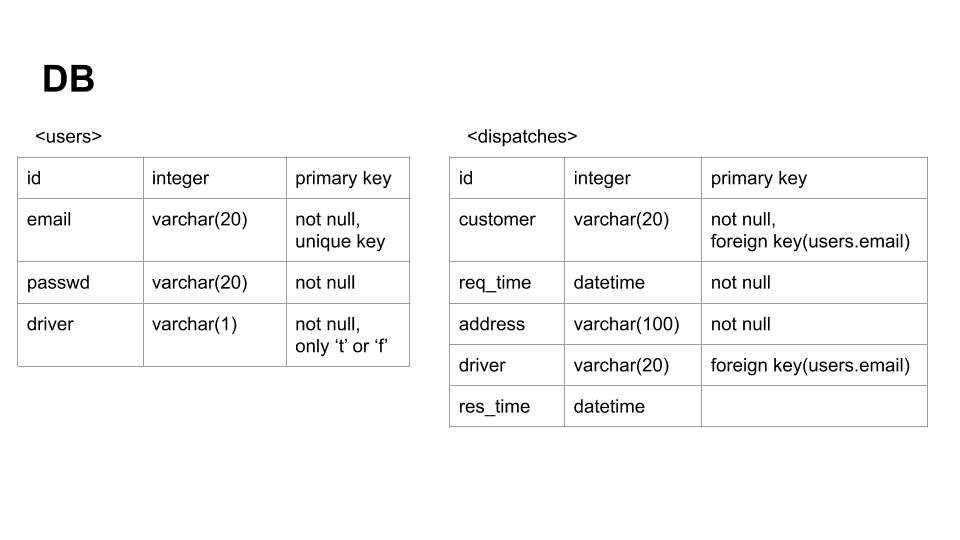

# Overview
Drama & Company 과제

# Environments
* Python 2.7
* pip 19.1.1

# 실행
### 1) Install packages
```shell
pip install -r web_app/requirements.txt
```

### 2) 서버 실행
```shell
cd web_app
chmod 755 start.sh
./start.sh
```
### 3) 서버 접속
http://localhost:5000<br>
ex) 배차 조회 API => http://localhost:5000/v1/dispatches<br>

# DB 설계


# API 스펙
### 1) 회원 가입
* /v1/users/create
* POST
* Data
  * email(String)
  * passwd(String)
  * driver(String) :'t' or 'f'
* Response
```json
{
	"users": {"email": "xxx@gmail.com", "driver": "t"}
}
```
* Error
```json
# 이메일 중복
{
	"error": {
		"code": 422,
		"message": "Duplicate email",
		"more_info": {"email": "xxx@gmail.com"}
	}
}
```

    
### 2) 로그인
* /v1/users/login
* POST
* Data
	* email(String)
	* passwd(String)
* Response
```json
{
	"users": {"email": "xxx@gmail.com"}
}
```
* Error
```json
# 이메일/비번 잘못 입력
{
	"error": {
		"code": 422,
		"message": "Wrong email or password",
		"more_info": {"email": "xxx@gmail.com"}
	}
}
```

### 3) 배차 요청
* /v1/dispatches/request
* POST
* Data
	* email(String) : customer
	* address(String)
* Response
```json
{
	"dispatch": {"email": "xxx@gmail.com", "address": "nowon-gu"}
}
```
* Error
```json
# 올바르지 않는 유저
{
	"error": {
		"code": 422,
		"message": "Invaild customer",
		"more_info": {}
	}
}
```

### 4) 배차 조회
* /v1/dispatches
* GET
* Response
```json
{
	"dispatches": {
		"wait": [
			{"customer": "xxx@gmail.com", "address": "nowon-gu", "req_time": "2019-01-01 00:00:00"}
		],
		"complete": [
			{"customer": "xxx@gmail.com", "address": "nowon-gu", "req_time": "2019-01-01 00:00:00", "driver": "xxx@gmail.com", "res_time": "2019-01-01 01:00:00"}
		],
	}
}
```

### 5) 배차 응답
* /v1/dispatches/response
* PUT
* Data
	* email(String) : driver
	* dispatch_id(Integer)
* Response
```json
{
	"dispatch": {"email": "xxx@gmail.com", "dispatch_id": 1}
}
```
* Error
```json
# 올바르지 않는 유저
{
	"error": {
		"code": 422,
		"message": "Invaild driver",
		"more_info": {}
	}
}

# 이미 배차됨
{
	"error": {
		"code": 422,
		"message": "This dispatch was already allocated",
		"more_info": {}
	}
}
```
