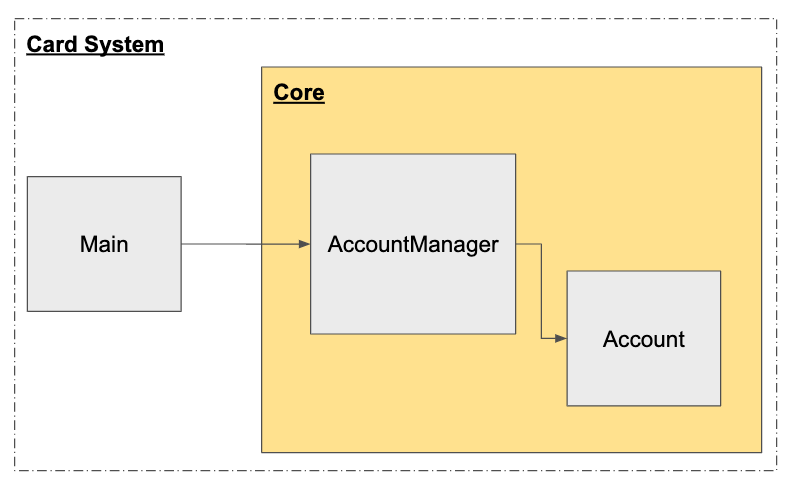

# Overview
Card System

<br>
- 코어는 Account, AccountManager로 이루어짐
- Account는 카드와 관련된 작업 처리함(생성, 적립, 결제)
- AccountManager는 외부(코어 밖)에서 Account에 접근 관련 managing 역활


# Prerequisite
python3.5<br>
python packages :
```shell
pip install requirementx.txt
```

# Run
### 1. Run Card System
```shell
chmod 755 run_card_system
./run_card_system input.txt
./run_card_system < input.txt
```

### 2. Run test
```shell
python test_card_system.py
```


# Trouble-Shooting
### import error
1. error message
```
Traceback (most recent call last):
  File "./run_card_system", line 7, in <module>
    from card_system import AccountManager
  File "/Users/glowdayz/Downloads/soomgo/card_system.py", line 4, in <module>
    import luhn
ImportError: No module named luhn
```
2. solution<br>
위 "Prerequisite"에서 python packages를 설치한 python path와 run_card_system에서 명시된 python path가 일치 하는지 확인<br>
```python
#!/usr/bin/python <= 이 경로
# -*- coding:utf-8 -*-

import sys

from card_system import AccountManager
```

